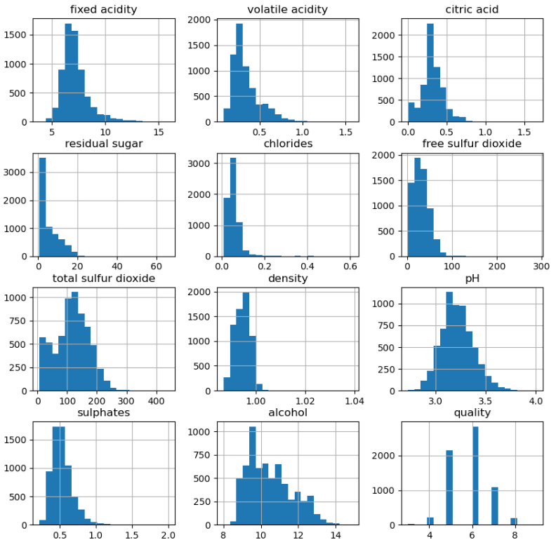
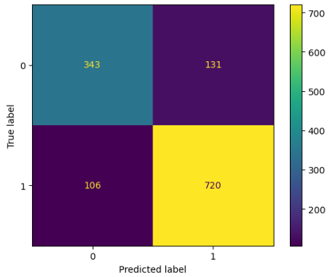

# Wine Quality Prediction using Machine Learning

## Project Overview
This project aims to **predict the quality of wine** based on various physicochemical properties such as acidity, sugar content, and alcohol concentration. The goal is to build a model that can **classify wine quality** and assist in **quality control and production improvement** in the wine industry.

---

### Dataset:
| Feature | Description |
|----------|-------------|
| fixed acidity | Amount of nonvolatile acids |
| volatile acidity | Amount of acetic acid in wine |
| citric acid | Weak organic acid present in wine |
| residual sugar | Amount of sugar remaining after fermentation |
| chlorides | Amount of salt in the wine |
| free sulfur dioxide | Free form of SO₂ for preservation |
| total sulfur dioxide | Total concentration of SO₂ |
| density | Density of the wine |
| pH | Level of acidity or basicity |
| sulphates | Wine additive that contributes to SO₂ gas |
| alcohol | Percentage of alcohol content |
| quality | Quality score assigned by wine tasters (0–10) |

---

## Methodology

### 1. **Data Preprocessing**
- Checked for missing values and duplicates  
- Scaled numerical features for uniformity  
- Split the dataset into training and testing sets  

---

### 2. **Exploratory Data Analysis (EDA)**
- Analyzed relationships between chemical features and wine quality  
- Visualized the distribution of features  

**Feature Distribution:**  

---

### 3. **Model Building**
Built and compared the following machine learning classifiers:
1. **Logistic Regression**  
2. **XG Boost**  
3. **Support Vector Machine (SVM)**  

---

### 4. **Model Evaluation**
- Evaluated models using accuracy, precision, recall, and F1-score  
- Generated visualizations for better understanding of results  

**Confusion Matrix:**  

---

## Results
## Results and Discussion

The following table summarizes the performance of all three models on the test dataset:

| **Model**              | **Accuracy** | **Precision (avg)** | **Recall (avg)** | **F1-Score (avg)** |
|-------------------------|--------------|---------------------|------------------|--------------------|
| Logistic Regression     | 0.74         | 0.72                | 0.69             | 0.70               |
| **XGBoost**             | **0.82**     | **0.81**            | **0.80**         | **0.81**           |
| SVM                     | 0.75         | 0.73                | 0.70             | 0.70               |

---

## Installation

1\. Clone the repository:

    git clone https://github.com/AShr12xz/Wine_Quality_Prediction.git
    cd Wine_Quality_Prediction

2️\. Install dependencies:

    pip install pandas numpy scikit-learn matplotlib seaborn
    
3\. Run the notebook Wine_Quality_Prediction.ipynb

---

## Technologies Used

| Category | Tools / Libraries |
|-----------|-------------------|
| **Programming Language** | Python 3.8+ |
| **Data Handling** | pandas, numpy |
| **Data Visualization** | matplotlib, seaborn |
| **Machine Learning** | scikit-learn |
| **Notebook Environment** | Jupyter Notebook |

